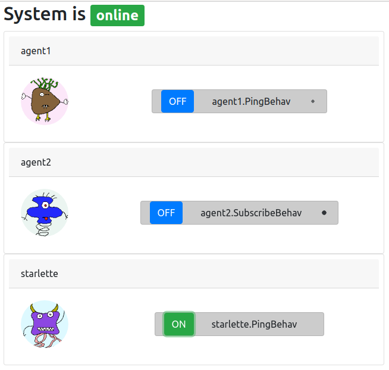

Feature Tour
============
The building block of the framework is an agent with its behaviour. A behaviour encodes the business logic and
uses messages for communication with other agents' behaviours.

Munggoggo Demo
-----------------
The following demo consists of:

1. start RabbitMQ
2. start agent, which subscribes to the RabbitMQ topic ``ping``
3. start agent, which publishes to the RabbitMQ topic ``ping``
4. start agent, which publishes to the RabbitMQ topic ``ping`` and exposes an ASGI application with WEB endpoints

After starting this demo a basic react frontend is available at::

    http://localhost:8000/static/frontend/index.html

.. raw:: html

    

Run RabbitMQ
-----------------
All agents communicate via message bus::

    # prerequisite: docker, docker-compose
    cd rmq
    docker-compose up

Basic Agent
-----------------

Basic agent with simple *ping* behaviour::

    $ python agent1.py

Basic agent with subscribe behaviour::

    $ python agent2.py

ASGI Agent for WEB exposure
---------------------------
An ASGI agent provides several protocols: websockets, jsonrpc and HTTP/REST.
A full demo ASGI agent can be found in the project directory.
Every ASGI agent exposes multiple endpoints while providing full agent functionality::

    $ python asgi.py

This exposes the following endpoints::

    http:localhost:8000
    http:localhost:8000/ws
    http:localhost:8000/jsonrpc
    http:localhost:8000/openapi
    http://localhost:8000/static/frontend/index.html

Websockets
~~~~~~~~~~~~~~~~~~~~~
Websockets are being used for frontend communication.

JsonRPC
~~~~~~~~~~~~~~~~~~~~~
You can test the jsonrpc endpoint by calling a builtin demo function (multiplication of two integers)::

    $ curl -X POST -H "content-type: application/json" -d '{"method":"example_rpc_method","params":[3,2],"jsonrpc":"2.0","id":1}' http://localhost:8000/jsonrpc

OPENAPI documentation
~~~~~~~~~~~~~~~~~~~~~
The endpoints are documented via `OPENAPI <https://swagger.io/docs/specification/about/>`_, of course::

    http:localhost:8000/openapi

Frontend
~~~~~~~~~~~~~~~~~~~~~
A basic react frontend is available at::

    http://localhost:8000/static/frontend/index.html

